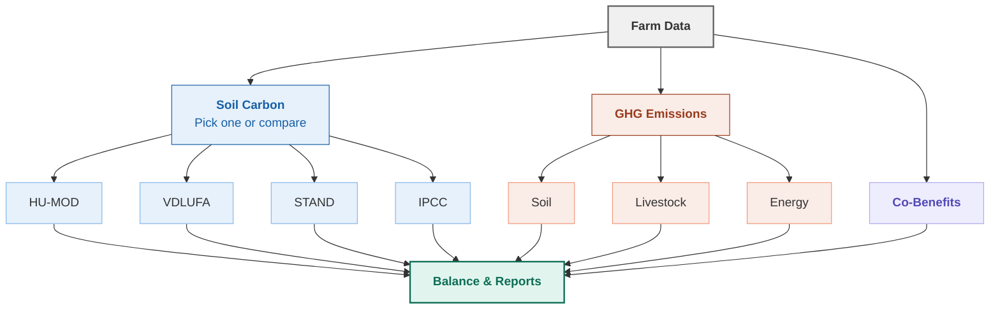

# Open-Farm-Tool
Development of a sustainability assessment tool from scratch

Current version: https://farm.goku-lab.com/


```
openfarmtool/
├── core/                          # Calculation engine
│   ├── farm.py                    # Central farm data model
│   ├── balance.py                 # Aggregates results from all modules
│   ├── soil_carbon/               # Soil carbon methods
│   │   ├── humod.py               # HU-MOD humus balance
│   │   ├── vdlufa.py              # VDLUFA lookup method
│   │   └── ipcc_tier1.py          # IPCC stock change factors
│   ├── emissions/                 # GHG calculations
│   │   ├── soil_n2o.py            # N₂O from soils
│   │   └── energy.py              # Energy CO₂
│   └── cobenefits/                # Biodiversity, soil health, water
├── data/                          # Reference databases
│   ├── humod/                     # HU-MOD parameters
│   │   ├── crop_parameters.json   # 61 crops
│   │   ├── fertiliser_parameters.json  # 29 fertilisers
│   │   └── model_constants.json   # Model constants
│   ├── ipcc/                      # IPCC emission factors
│   └── energy/                    # Grid electricity factors
├── schema/                        # Data validation models
├── io/                            # Excel/CSV/JSON readers and writers
├── tests/                         # Automated tests
├── scripts/                       # Utility scripts (e.g., extraction)
├── docs/                          # Documentation
└── pyproject.toml                 # Package configuration
```
